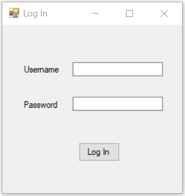
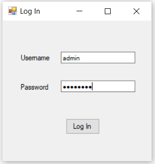
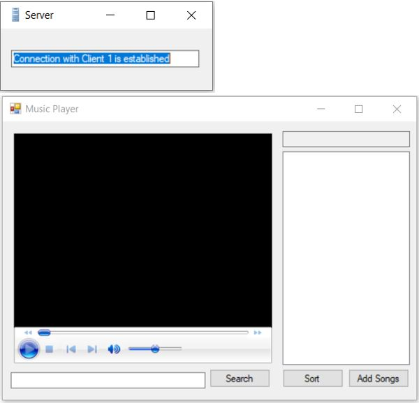
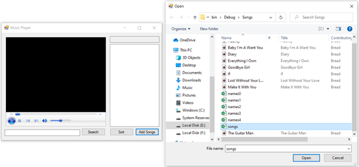
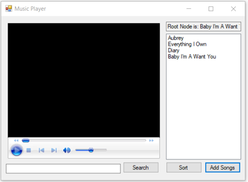
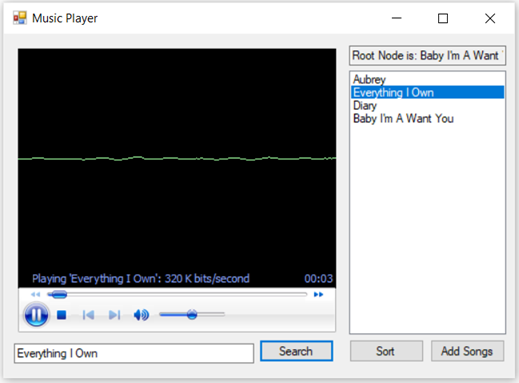
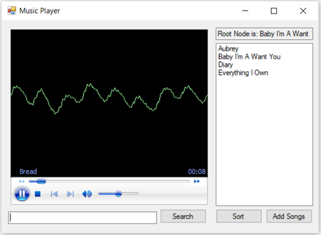

<h1>JMCMusicPlayer-CSharp</h1>

<em>This project is developed according to South Metropolitan TAFE requirements.</em>

 * Developer: Jose Rico Imbang
 * Student Id: 30019932
 * Date: 26/11/2020
 * AT3 - Project
 * South Metropolitan TAFE, Diploma of Software Development
 * Third party library link - https://www.codeproject.com/Articles/9258/A-Fast-CSV-Reader

<h2>Introduction</h2>

There are two applications for this project – the Server and the Client. The former serves as the server on which the Client application can connect through Inter Process Communication (IPC) using Named Pipes, as long as they are on the same network. The Server application needs to be running before the Client application can request to establish a connection.
Once the Server is up and running, the user can open the Client application. The user will be prompted to enter his login details, and once entered, he can then click the Log In button and the Client application will send the information to the Server. The Server hashes the password then verifies the username and the hashed password. The user is prompted if the login details are incorrect. But if it is correct, the login window hides, and the music player window is shown. The UI of the Server application also shows a message that the Client is able to establish a connection. The user can add songs using the Add Songs button. The full path of the songs is saved in a CSV file so a third-party library is used to read those information. They are then saved into an AVL Tree. The unsorted names of the songs are then listed on the ListBox. There is a TextBox that the user can use to search for a specific song. Once the user typed in the name of the song into the TextBox, he then can click the Search button. The algorithm that is used to search songs is Binary Search. If the song is found, Windows Media Player plays it and the song’s name that is on the ListBox is highlighted. There is also a button to Sort the songs and it uses Merge Sort. 
 
 
<table border="1" cellpadding="4" cellspacing="0">
  <thead>
    <tr>
      <th>Test Case</th>
      <th>Description</th>
      <th>Expected Outcome</th>
      <th>Screenshot</th>
    </tr>
  </thead>
  <tbody>
    <tr>
      <td>Case 1</td>
      <td>Run the Server</td>
      <td>Server up and ready.</td>
      <td></td>
    </tr>
  </tbody>
  <tbody>
    <tr>
      <td>Case 2</td>
      <td>Run the Client</td>
      <td>Log In form shows up.</td>
      <td></td>
    </tr>
  </tbody>
  <tbody>
    <tr>
      <td>Case 3</td>
      <td>Enter Login details</td>
      <td>The password’s characters are hidden.</td>
      <td></td>
    </tr>
  </tbody>
  <tbody>
    <tr>
      <td>Case 4</td>
      <td>Click Log In button</td>
      <td>The Log In form hides and the Music Player form is shown. The Server app shows a message that the connection with a Client is established.</td>
      <td></td>
    </tr>
  </tbody>
  <tbody>
    <tr>
      <td>Case 5</td>
      <td>Click Add Songs button</td>
      <td>A dialog box opens up and the user can select a CSV file.</td>
      <td></td>
    </tr>
  </tbody>
  <tbody>
    <tr>
      <td>Case 6</td>
      <td>Click Open button from the dialog box</td>
      <td>The songs are listed on the ListBox and a TextBox shows the Root Node.</td>
      <td></td>
    </tr>
  </tbody>
  <tbody>
    <tr>
      <td>Case 7</td>
      <td>Type the name of the song and the click Search button</td>
      <td>The song plays if it is found and the name is on the ListBox is highlighted.</td>
      <td></td>
    </tr>
  </tbody>
  <tbody>
    <tr>
      <td>Case 8</td>
      <td>Click Sort button</td>
      <td>The unsorted song names on the ListBox are sorted.</td>
      <td></td>
    </tr>
  </tbody>
</table>
