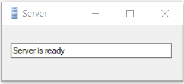

# JMCMusicPlayer-CSharp

The JMC Music Player is an application designed for Jupiter Mining Corporation employees. The users need to log in using their credentials (the application uses hashing technique) to be able to use the application to search, play and sort the songs stored in a binary tree. The application loads and saves the path of the songs from and into a CSV file using a third-party library.

The algorithm used for sorting is merge sort, and for searching is binary search.

Please see the How-To Guide by clicking Help from the menu bar for assistance in operating the application.

 * Developer: Jose Rico Imbang
 * Student Id: 30019932
 * Date: 03/12/2020
 * AT3 - Project
 * South Metropolitan TAFE, Diploma of Software Development
 * Third party library link - https://www.javatpoint.com/how-to-read-csv-file-in-java
 
<table border="1" cellpadding="4" cellspacing="0">
  <thead>
    <tr>
      <th>Test Case</th>
      <th>Description</th>
      <th>Expected Outcome</th>
      <th>Screenshot</th>
    </tr>
  </thead>
  <tbody>
    <tr>
      <td>Case 1</td>
      <td>Run the Server</td>
      <td>Server up and ready.</td>
      <td></td>
    </tr>
  </tbody>
  <tbody>
    <tr>
      <td>Case 2</td>
      <td>Run the Client</td>
      <td>Log In form shows up.</td>
      <td></td>
    </tr>
  </tbody>
</table>
